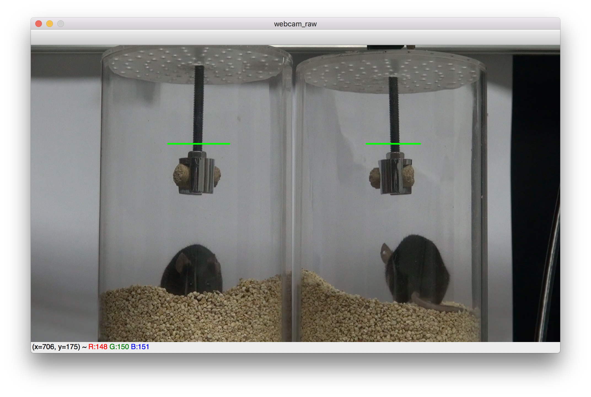
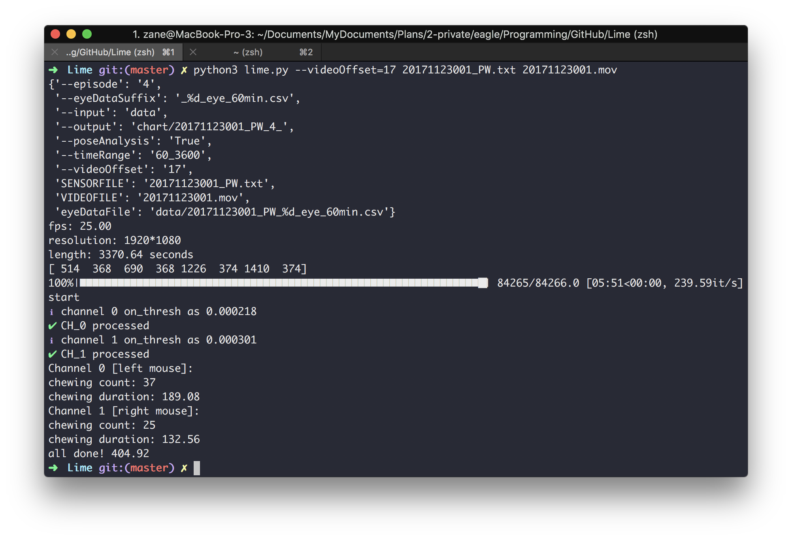

# Lime
analysis program for chewing behavior of Zhang's Lab.

## Usage 使用方法

使用方法与相关可调参数如下。运行后会首先弹出第一帧，拖拽可画水平线作为截取的区域，高度默认为2px。先选取左侧(0)，再选取右侧(1)；完成后键入回车。程序运行完后(ca. 6min.), 会输出综合的chew count与chew duration值。

数据文件(\*\_PW.txt, \*.mov)默认放于data文件夹(或者自行修改```--input```参数)中。最终数据输出于chart文件夹中(或者自行修改```--output```参数)；另外，chew count与chew duration值仅输出在终端，请注意保存。

体重信息的录入，请使用``` limeWight.py ```文件。

**NOTE**: 如果重复运算同一个session，可能会出现```sqlite3.IntegrityError: UNIQUE constraint failed: summary.SessionID```的报错，下次再改吧[苦笑脸]。解决方法: 在sqlite3里手工把那个条目删除再运行。

```
Lime
analysis program for chewing behavior of Zhang's Lab.

Usage: lime.py [options] SENSORFILE [VIDEOFILE]

Options:
-c GAP --climbEpisode=GAP               # climbing episode gap length, unit as second [default: 0]
--debug                                 # debug mode
-d DATE --date=DATE                     # session date [default: YYYYMMDD]
-e GAP --episode=GAP                    # episode gap length, unit as second [default: 4]
-f FOOD --food=FOOD                     # food weight data, unit as gram [default: 2.000_1.000]
-i INDIR --input=INDIR                  # data directory [default: data]
-l LENGTH --length=LENGTH               # session length, unit as minute [default: 60]
-m MICESEQ --miceSequence=MICESEQ       # mice sequence, from left to right [default: C1M1/C1M2/C1M3/C1M4]
-n NCAGE --cageNum=NCAGE                # total mice number in this session [default: 2]
-o OUTDIR --output=OUTDIR               # chart directory [default: chart]
-p --poseAnalysis                       # need pose analysis only? [default: false]
-r RANGE --timeRange=RANGE              # checking range, unit as second [default: 60_3600]
-t TIME --startTime=TIME                # start time point [default: HHMM]
-u SETUP --setup=SETUP                  # setup prefix, one of "TtC_NN","TtC_NH", "TtC_HH", "TtV_NN","TtV_NH", "TtV_HH" [default: TtV_NN]
-v OFFSET --videoOffset=OFFSET          # video offset, aligning with sensor time, counts as second [default: 0.0]
-w WIDTH --width=WIDTH                  # target area width, unit as px [default: 20]
""".format(version=__version__)
```

```
LimeWeight {version}

Usage: LimeWeight.py -c CAGENUM -d DATE [options] (WEIGHTSEQ ...)

Options:
--debug         # debug mode
-c CAGENUM      # cage number
-n NMICE        # total mice sum [default: 8]
-i INPUTDIR     # input data directory [default: data]
-f DATABASE     # database file [default: chewing.db]
```

## Demo 示例

typical command:
- 2 mice set: ```python3 lime.py -d 20171213 -t 1430 -u TtC_NH -m C1M1/C2M1 -v 17 -f 3.653_3.142 20171213001_PW.txt 20171213001.mov```
- 4 mice set: ```python3 lime.py -d 20171213 -t 1430 -u TtC_NH -n 4 -m C1M1/C2M1/C1M2/C2M2 -v 17 -f 3.653_3.142 20171213001_PW.txt 20171213001.mov```


( drag to draw two lines for target area, the left line first; then press ```ENTER``` for further procedures )



## Files Structure 文件目录结构

```
LimeOne
+-data
|  +- chewing.db
|  +- 20171123001_PW.txt
|  +- 20171123001.mov
|  +- ...
+-LimeOne
|  +- ...
+-chart
|  +- 20171123001_PW_4_0
|  |  +- ...
|  +- 20171123001_PW_4_1
|  |  +- ...
+-lime.py
+-README.txt
+-requirements.txt
```

## requirements Python依赖模块

- docopt
- matplotlib
- numpy
- scipy [optional]
- pandas
- opencv-python
- Cython [optional]
- halo [optional]
- tqdm

- SQLite3
